<div align="center">



<br/>

<a href="https://github.com/ishandutta2007/Awesome-Awesome-Awesome"></a>
<a href="https://discord.gg/jc4xtF58Ve"></a>
<a href="https://github.com/ishandutta2007"></a>

<br/>

# ⚡ Awesome Cloud Resource Optimization

**A curated directory of SaaS platforms, open-source tools, and automated engines for Kubernetes rightsizing, spot instance orchestration, smart bin-packing, and cloud FinOps waste reduction.**

*Updated regularly • Maintained by platform engineers, SREs, and FinOps practitioners*

</div>

---

## 🔍 Overview & Context

Modern cloud-native architectures frequently suffer from **30%–50% resource over-provisioning** across compute, memory, and storage. Cloud Resource Optimization bridges platform engineering and financial operations (FinOps) to continuously eliminate cloud waste without sacrificing performance or workload availability.

This guide tracks both commercial enterprise SaaS platforms and self-hosted open-source software covering:
- **Autonomous Kubernetes Rightsizing**: Dynamic adjustment of container CPU and memory requests/limits based on live runtime telemetry.
- **Spot Instance Orchestration**: Safe, zero-downtime execution of stateless and resilient stateful workloads on ephemeral, deep-discount compute.
- **High-Density Bin Packing**: Consolidating dispersed pods into fewer, optimally sized nodes to minimize idle headroom.
- **Shift-Left FinOps & Pre-Deployment Cost Estimation**: Calculating cloud cost impact directly inside pull requests and CI/CD pipelines before deployment.
- **Automated Lifecycle & Off-Hours Scheduling**: Hibernating development and staging resources during non-working hours.

---

## 📑 Table of Contents

- [🏢 SaaS & Hosted Commercial Platforms](#-saas--hosted-commercial-platforms)
- [🛠️ Open-Source GitHub Projects](#️-open-source-github-projects)
  - [🏗️ Infrastructure as Code (IaC) & Pre-Deployment Cost Estimation](#️-infrastructure-as-code-iac--pre-deployment-cost-estimation)
  - [⚡ Kubernetes Autoscaling, Node Provisioning & Spot Management](#-kubernetes-autoscaling-node-provisioning--spot-management)
  - [📊 FinOps Platforms, Cost Monitoring & Governance](#-finops-platforms-cost-monitoring--governance)
  - [🎯 Kubernetes Workload Rightsizing & Resource Optimization](#-kubernetes-workload-rightsizing--resource-optimization)
- [💡 Architectural Blueprints for Cloud Optimization](#-architectural-blueprints-for-cloud-optimization)
- [📈 Star History](#-star-history)
- [💖 Support & Community](#-support--community)
- [🤝 How to Contribute](#-how-to-contribute)
- [⚖️ Disclaimer](#️-disclaimer)

---

## 🏢 SaaS & Hosted Commercial Platforms

> **Market Size & Industry Dynamics:** The global Cloud Cost Management and Optimization market is estimated at **~$10.5B+ in 2026** and projected to reach **~$22.9B+ by 2030** (CAGR ~21.4%). The sector is currently **moderately fragmented, transitioning to rapid consolidation** by major cloud management and IT Operations Management (ITOM) enterprise vendors (e.g., IBM acquiring Turbonomic, Apptio, and Kubecost; NetApp acquiring Spot.io; Intel acquiring Granulate; DoiT acquiring PerfectScale).

The table below catalogs leading commercial SaaS optimization platforms, sorted by **Company Size / Valuation / Revenue descending**:

| Product Name / Link | Description | Pricing | Free Tier Limits | Company Size / Valuation / Revenue |
| :--- | :--- | :--- | :--- | :--- |
| **[IBM Turbonomic](https://www.ibm.com/products/turbonomic)** | AI-driven Application Resource Management (ARM) dynamically optimizing compute, memory, and storage allocations across multi-cloud and hybrid environments. | Starts at **$21.15/Managed Virtual Server (MVS)/month** (~$254/MVS/yr; standard starter pack of 200 MVS starts at ~$50,760/year). | **30-day free trial** with unlimited managed virtual servers; no credit card required. | **IBM** (Parent Market Cap: ~$210B+, Annual Revenue: ~$62B; acquired Turbonomic for ~$1.5B–$2B; 280,000+ employees). |
| **[Spot by NetApp](https://spot.io/products/ocean/)** | Automated cloud compute optimization and spot instance orchestration engine (Ocean, Elastigroup) ensuring workload SLAs while cutting compute bills by 60%–90%. | Starts at **~15%–20% of net verified savings** (or ~$0.08/vCPU-hour pay-as-you-go; typical enterprise contracts average ~$1,000/mo or ~$17,000/yr). | **Freemium plan** managing up to **20 virtual machines permanently free**; 14-day full-access trial on AWS Marketplace. | **NetApp** (Parent Market Cap: ~$26B, Annual Revenue: ~$6.3B; acquired Spot for ~$450M in 2020; ~12,000 employees). |
| **[Granulate](https://granulate.io/)** | Autonomous runtime workload optimization leveraging OS-level kernel telemetry to improve CPU utilization and latency with zero code changes *(sunsetted by Intel in 2025)*. | Historically **15%–20% of compute cost reduction** or starting at $500/month POC packages *(technology sunsetted by Intel in early 2025)*. | Historically **14-day free trial** with automated workload profiling audit. | **Intel** (Parent Market Cap: ~$95B; acquired Granulate for ~$650M in 2022; ~120,000 employees; sunsetted in 2025). |
| **[Kubecost](https://www.kubecost.com/)** | Kubernetes real-time cost visibility, multi-cloud billing breakdown, and workload rightsizing recommendations across clusters, namespaces, and pods. | Starts at **$499/month** (Business tier up to 500 vCPUs or ~$15/node/month); Enterprise volume licensing on custom quote. | **Free Forever plan** for **1 Kubernetes cluster** (unlimited nodes, 15-day metrics retention); 30-day enterprise trial. | **IBM / Apptio** (Acquired by IBM in Sep 2024; prior Series A raised $19.5M, ~50 employees; now part of IBM FinOps suite). |
| **[CloudBolt](https://www.cloudbolt.io/)** | Enterprise hybrid cloud management and orchestration platform delivering cost governance, cloud provisioning, and automated resource scheduling. | Starts at **~$20/VM/year** (~$1.67/VM/month, base entry tier starting at ~$10,000/year for enterprise bundles). | **Free Community Edition** managing up to **100 hybrid resources** (VMs, clusters, storage) permanently; 30-day sandbox trial. | **Private / PE-backed** (Insight Partners, ~$40M–$50M ARR, 200+ employees). |
| **[CAST AI](https://cast.ai/)** | Autonomous Kubernetes optimization and cost management platform providing auto-scaling, bin-packing, rightsizing, and automated spot orchestration across AWS, GCP, Azure, and OCI. | Starts at **$0.005/vCPU/hour** with automated optimization paid plans starting from a base fee of **~$200–$1,000/month** plus compute usage fees. | **Free Forever Cost Monitoring tier** (unlimited Kubernetes clusters & nodes, real-time cost analytics and savings recommendations). | **Series B** ($73M total raised, led by Creandum & Vintage; ~$250M–$300M valuation, ~150 employees, $15M+ ARR). |
| **[Zesty](https://zesty.co/)** | Dynamic cloud commitment automation (Commitment Manager) and auto-scaling EBS disk allocation (Zesty Disk) without manual intervention. | Success fee of **25% of verified savings generated** ($0 base fee; requires minimum monthly AWS EC2 spend of $7,000). | **Free initial cloud workload and savings assessment audit** (no upfront fee or software commitment). | **Series B** ($116M total raised, $75M Series B led by B Capital & SoftBank; ~$250M+ valuation, ~130 employees). |
| **[ProsperOps](https://www.prosperops.com/)** | Autonomous discount management platform for AWS, GCP, and Azure that algorithmically buys, sells, and optimizes Savings Plans and Reserved Instances. | **30%–35% of realized net savings** (Savings Share model, $0 upfront fee); resource scheduler charged at flat fee (~$5/resource/month). | **Free historical cloud savings analysis** and peer benchmarking audit; no permanent free tier. | **Series A** ($72M funding led by H.I.G. Growth Partners; managing >$1.5B+ annualized cloud compute spend, ~80 employees). |
| **[StormForge](https://www.stormforge.io/)** | ML-driven Kubernetes resource optimization platform providing automated rightsizing recommendations for CPU and memory, integrated with HPA/VPA and GitOps. | Starts at **$0.0041/vCPU-hour** (~$3.00/vCPU/month) pay-as-you-go; mid-market enterprise contracts start around $50,000/year. | **30-day fully functional free trial** (unlimited workloads and clusters, no credit card required). | **Series B** (~$60M raised, backed by Insight Partners; ~70 employees). |
| **[Densify](https://www.densify.com/)** *(Kubex)* | Predictive machine-learning analytics engine delivering precision rightsizing and container placement recommendations across Kubernetes, VMware, and cloud. | Starts at **~$2.50/instance or VM/month** (typically bundled in enterprise annual subscriptions starting at ~$15,000/year). | **30 to 60-day guided proof of value / free trial** with custom environmental telemetry analysis. | **Private / Cirba Inc.** (~100 employees, estimated ~$20M–$30M ARR). |
| **[PerfectScale](https://www.perfectscale.io/)** | Intent-aware Kubernetes resilience and rightsizing platform balancing cost savings with production reliability, SLA headroom, and autoscaling. | Tiered starting at **1%–3% of managed Kubernetes compute spend** (or ~$5/node/month for advanced automation tier). | **Free Community Tier** (unlimited clusters, nodes, and pods for issue detection and rightsizing recommendations); 30-day trial for Expert plan. | **Acquired by DoiT** in Feb 2025 (previously raised $10M Seed led by Blumberg Capital; DoiT manages $2.5B+ cloud spend). |

---

## 🛠️ Open-Source GitHub Projects

This section catalogs battle-tested open-source projects for self-hosting, custom automation logic, and transparent cloud telemetry. Each project includes a real-time GitHub star count badge and is organized by domain, **sorted by star count descending**.

### 🏗️ Infrastructure as Code (IaC) & Pre-Deployment Cost Estimation

- **[Infracost](https://github.com/infracost/infracost)** [](https://github.com/infracost/infracost/stargazers)  
  *Shift FinOps left by estimating cloud costs directly in pull requests.*  
  Infracost scans Terraform code, Terraform Cloud, and Infracost CLI runs to generate real-time cost impact reports on PRs before infrastructure is provisioned, preventing budget overruns before they reach production.

- **[Terracost](https://github.com/cycloidio/terracost)** [](https://github.com/cycloidio/terracost/stargazers)  
  *Cloud cost estimation tool for Terraform in your local CLI.*  
  Analyzes Terraform plans against cloud pricing data to calculate estimated infrastructure costs directly during early development cycles.

---

### ⚡ Kubernetes Autoscaling, Node Provisioning & Spot Management

- **[Karpenter](https://github.com/kubernetes-sigs/karpenter)** [](https://github.com/kubernetes-sigs/karpenter/stargazers)  
  *Next-generation, high-performance Kubernetes node autoscaler.*  
  Built under CNCF SIGs (with widespread AWS deployment via [karpenter-provider-aws](https://github.com/aws/karpenter-provider-aws) [](https://github.com/aws/karpenter-provider-aws/stargazers)), Karpenter rapidly launches right-sized compute nodes directly in response to pending pods. It continuously consolidates, bin-packs, and terminates underutilized nodes to maximize compute efficiency and minimize cluster costs.

- **[Cloud Nuke](https://github.com/gruntwork-io/cloud-nuke)** [](https://github.com/gruntwork-io/cloud-nuke/stargazers)  
  *Automated multi-cloud resource cleanup CLI.*  
  Powerful utility to delete all resources in cloud accounts (AWS, Azure, GCP). Invaluable for cleaning up zombie test/staging accounts, ephemeral CI/CD environments, and eliminating runaway infrastructure waste.

- **[AutoSpotting](https://github.com/AutoSpotting/AutoSpotting)** [](https://github.com/AutoSpotting/AutoSpotting/stargazers)  
  *Automated EC2 Spot instance replacement engine.*  
  Converts existing AutoScalingGroups into diversified, cost-effective Spot instances on-the-fly without requiring modifications to original AutoScalingGroup configurations, providing up to 90% savings.

- **[KubeSurvival](https://github.com/aporia-ai/kubesurvival)** [](https://github.com/aporia-ai/kubesurvival/stargazers)  
  *Cheapest instance type finder for Kubernetes.*  
  Analyzes cluster pod resource requirements and recommends the most cost-effective machine types and node group combinations to run workloads reliably.

---

### 📊 FinOps Platforms, Cost Monitoring & Governance

- **[Steampipe](https://github.com/turbot/steampipe)** [](https://github.com/turbot/steampipe/stargazers)  
  *Query live cloud infrastructure using SQL without ETL pipelines.*  
  Features 150+ plugins covering AWS, Azure, GCP, and Kubernetes. Enables engineers to write simple SQL queries to immediately surface idle volumes, untagged resources, zombie load balancers, and unattached IP addresses.

- **[OpenCost](https://github.com/opencost/opencost)** [](https://github.com/opencost/opencost/stargazers)  
  *CNCF Incubating vendor-neutral Kubernetes and cloud cost allocation engine.*  
  Provides real-time cost allocation and breakdown by cluster, node, namespace, controller, service, or pod. Supports AWS, GCP, Azure, on-prem bare metal, GPU telemetry, and Model Context Protocol (MCP) servers for AI agent integrations.

- **[Cloud Custodian](https://github.com/cloud-custodian/cloud-custodian)** [](https://github.com/cloud-custodian/cloud-custodian/stargazers)  
  *CNCF Incubating rules engine for cloud governance, cost management, and security.*  
  Uses a simple YAML-based DSL to define and enforce automated policies. Native capabilities include scheduling resource off-hours, auto-stopping non-production clusters, enforcing tags, and cleaning up orphan snapshots across AWS, Azure, and GCP.

- **[Komiser](https://github.com/tailwarden/komiser)** [](https://github.com/tailwarden/komiser/stargazers)  
  *Cloud resource manager and inventory analyzer.*  
  Scans multi-cloud environments (AWS, Azure, GCP, DigitalOcean, Civo, OCI) to build a unified infrastructure inventory, detecting misconfigurations, unused resources, and hidden spend drivers.

- **[OptScale](https://github.com/hystax/optscale)** [](https://github.com/hystax/optscale/stargazers)  
  *Comprehensive open-source FinOps platform with MLOps/GPU cost governance.*  
  Supports AWS, Azure, GCP, Alibaba Cloud, and Kubernetes. Delivers cost analytics, anomaly detection, rightsizing recommendations, budget alerts, and specialized cost tracking for AI training and LLM inference clusters.

- **[Koku](https://github.com/project-koku/koku)** [](https://github.com/project-koku/koku/stargazers)  
  *Red Hat open-source multi-cloud cost management service.*  
  Aggregates, categorizes, and reports infrastructure spend across AWS, Azure, GCP, and OpenShift/Kubernetes clusters with comprehensive organizational attribution.

- **[CostScope](https://github.com/costscope/costscope)** [](https://github.com/costscope/costscope/stargazers)  
  *Open FinOps and governance platform for AI, LLM, and GPU workloads.*  
  FOCUS 1.2 compatible. Ingests and normalizes AWS CUR, Azure, and GCP billing data. Integrates Kepler for GPU power and carbon metrics, and provides token-level LLM cost attribution.

- **[ecos](https://github.com/ecos-labs/ecos)** [](https://github.com/ecos-labs/ecos/stargazers)  
  *Open-source FinOps data stack powered by dbt and DuckDB.*  
  Transforms complex cloud billing data (AWS CUR) into clean, high-performance analytical datasets using 40+ pre-built dbt models. Includes an MCP server for natural language FinOps querying.

- **[Multi-Cloud FinOps](https://github.com/priyaranjan-sahu/multi-cloud-finops)** [](https://github.com/priyaranjan-sahu/multi-cloud-finops/stargazers)  
  *Multi-cloud cost optimization and anomaly detection engine.*  
  Compliant with FinOps Open Cost and Usage Specification (FOCUS 1.0). Provides automated spend forecasting, rightsizing logic, and KEDA autoscaler integration across AWS, GCP, and Azure.

- **[Fadvisor (FinOps Advisor)](https://github.com/gocrane/fadvisor)** [](https://github.com/gocrane/fadvisor/stargazers)  
  *Cloud pricing and billing telemetry exporters.*  
  Collects and exposes real-time pricing data for major cloud providers to enable fine-grained container cost allocation in Prometheus.

---

### 🎯 Kubernetes Workload Rightsizing & Resource Optimization

- **[Crane](https://github.com/gocrane/crane)** [](https://github.com/gocrane/crane/stargazers)  
  *Cloud Resource Analytics and Economics platform for Kubernetes.*  
  Delivers automated time-series forecasting, workload rightsizing (CPU/memory requests), effective HPA scheduling (TimeSeriesPredictor), and resource QoS isolation to maximize cluster utilization while guaranteeing service quality.

- **[Robusta](https://github.com/robusta-dev/robusta)** [](https://github.com/robusta-dev/robusta/stargazers)  
  *Kubernetes observability, automated troubleshooting, and cost profiling.*  
  Monitors cluster health and immediately surfaces OOMKilled containers, CPU throttling, and overprovisioned deployments directly in Slack/Teams with automated remediation workflows.

- **[Kube-capacity](https://github.com/robscott/kube-capacity)** [](https://github.com/robscott/kube-capacity/stargazers)  
  *Fast CLI to view resource requests, limits, and utilization.*  
  Provides a clean, intuitive terminal overview of total CPU and memory requests, limits, and live utilization across pods, nodes, and namespaces.

- **[Goldilocks](https://github.com/FairwindsOps/goldilocks)** [](https://github.com/FairwindsOps/goldilocks/stargazers)  
  *Automated baseline resource request and limit suggestions.*  
  Creates Vertical Pod Autoscaler (VPA) objects in "recommendation-only" mode to establish a baseline "just right" starting point for pod resource requests and limits without disrupting running pods.

- **[Kube Resource Suggest (KRS)](https://github.com/joe-l-mathew/kube-resource-suggest)** [](https://github.com/joe-l-mathew/kube-resource-suggest/stargazers)  
  *Suggestion-first, GitOps-safe Kubernetes resource optimizer.*  
  Never modifies live workloads directly. Emits non-intrusive `ResourceSuggestion` custom resources for team review using a hybrid Prometheus + Kubelet telemetry methodology with zero developer configuration.

- **[CruiseKube](https://github.com/truefoundry/CruiseKube)** [](https://github.com/truefoundry/CruiseKube/stargazers)  
  *Closed-loop autonomous Kubernetes rightsizing controller.*  
  Continuously monitors workload behavior and autonomously rightsizes CPU and memory requests at runtime and admission time, incrementally converging allocations to actual demand.

- **[k8s-rightsizer](https://github.com/mcpunzo/k8s-rightsizer)** [](https://github.com/mcpunzo/k8s-rightsizer/stargazers)  
  *Production-grade rightsizing controller with automatic rollback safety.*  
  Automatically rolls back to previous stable configurations if a newly rightsized pod experiences failures (e.g., OOMKilled, CrashLoopBackOff, or Unschedulable). Proven in production with 30%+ cost savings.

- **[SleepCycles](https://github.com/rekuberate-io/sleepcycles)** [](https://github.com/rekuberate-io/sleepcycles/stargazers)  
  *Off-hours sleep and wake-up scheduler for Kubernetes workloads.*  
  Automates scheduled scale-down/sleep of Deployments, StatefulSets, CronJobs, and HPAs during nights and weekends, reducing non-production compute expenses and carbon footprint.

- **[Cloud-Native K8s Optimizer](https://github.com/Sudharsanselvaraj/Cloud-Native-K8s-Cluster-Resource-Analysis-and-Optimization-Engine)** [](https://github.com/Sudharsanselvaraj/Cloud-Native-K8s-Cluster-Resource-Analysis-and-Optimization-Engine/stargazers)  
  *Workload utilization and overprovisioning analysis engine.*  
  Scans container CPU/memory usage patterns, identifies overprovisioned deployments, and outputs rightsizing recommendations with configurable safety headroom buffers.

---

## 💡 Architectural Blueprints for Cloud Optimization

When designing an internal resource optimization and FinOps pipeline, consider these battle-tested composite architectures:

```
[ Developer PR / Commit ]
        │
        ▼
   [ Infracost ] ──> Shifts FinOps left (predicts cost delta before merge)
        │
        ▼
[ Kubernetes Cluster ]
   ├── Provisioning:   [ Karpenter / AutoSpotting ]  (Right-sized node autoscaling + Spot)
   ├── Scheduling:     [ SleepCycles ]               (Off-hours sleep for dev/staging)
   ├── Rightsizing:    [ Crane / KRS / CruiseKube ]  (Safe CPU/Memory recommendation & tuning)
   └── Monitoring:     [ OpenCost / Steampipe ]      (Real-time allocation & query engine)
        │
        ▼
 [ Unified FinOps ] ──> [ OptScale / CostScope ]    (FOCUS-compliant multi-cloud + AI/GPU spend)
```

1. **Shift-Left Pre-Deployment Layer**: Use **Infracost** in GitHub Actions / GitLab CI to flag unexpected cost increases in Terraform PRs before cloud resources are provisioned.
2. **Dynamic Node Autoscaling Layer**: Deploy **Karpenter** for rapid, flexible node provisioning that matches actual pending workload requirements, combined with **AutoSpotting** for non-Kubernetes EC2 ASGs.
3. **Continuous Workload Rightsizing Layer**: Integrate **KRS** or **Crane** for safe, suggestion-based pod rightsizing, and use **k8s-rightsizer** for automated rollback safety.
4. **Environment Off-Hours Scheduling**: Implement **SleepCycles** or **Cloud Custodian** to spin down development, test, and staging clusters during off-hours, yielding an instant 40%–60% non-production compute savings.
5. **Multi-Cloud & AI/GPU Cost Governance**: Combine **OpenCost** for Kubernetes container cost visibility with **OptScale** or **CostScope** for FOCUS 1.2 compliant multi-cloud and GPU allocation.

---

## 📈 Star History

[](https://star-history.dera.page/#ishandutta2007/Awesome-Cloud-Resource-Optimization&type=date&legend=top-left)

---

## 💖 Support & Community

If you find this curated directory helpful for your platform engineering, DevOps, or FinOps initiatives, please consider supporting the project:

- ⭐ **Star this repository** on GitHub to show your appreciation and help others discover it!
- 🍴 **Fork the repository** and contribute your favorite optimization tools, controllers, and benchmarks.
- 📢 **Share with your network** on LinkedIn, Twitter/X, Reddit, or your engineering blog.
- ☕ **Sponsor the maintainer**: Community contributions help maintain and continuously update this directory with verified pricing data and architectural guides. You can sponsor directly via [GitHub Sponsors](https://github.com/sponsors/ishandutta2007).

<div align="center">

[](https://github.com/sponsors/ishandutta2007)

</div>

---

## 🤝 How to Contribute

Contributions from the community make this directory comprehensive and up-to-date!

1. **Fork this repository** to your GitHub account.
2. **Create a branch** for your changes: `git checkout -b add-tool-name`.
3. **Add or edit entries** in `README.md` following the established structure:
   - For **SaaS platforms**: Add to the table with Product Name/Link, Description, specific starting Tier Price, Free Tier Limits, and Company Size / Valuation / Revenue.
   - For **Open-Source projects**: Include Name, link, live star badge `[](https://github.com/OWNER/REPO/stargazers)`, and concise description. Sort alphabetically or by stars within the appropriate category.
4. **Test links and formatting** to ensure markdown rendering is clean.
5. **Submit a Pull Request** with a brief summary of what was added or updated.

---

## ⚖️ Disclaimer

- This repository is a **community-curated directory** provided for educational and informational purposes. Inclusion does not constitute an official endorsement.
- **Billing API Variance**: Cloud resource optimization recommendations rely on billing APIs and telemetry data. List prices may diverge from negotiated enterprise discounts (e.g., EDP, MACD, committed use contracts). Always perform internal billing reconciliation.
- **Operational Considerations**: Open-source tools like OpenCost, Karpenter, Crane, and OptScale provide complete data ownership and eliminate vendor lock-in; however, they require infrastructure maintenance (Prometheus, metrics pipelines, database storage) and engineering time. Commercial platforms like Cast AI, Turbonomic, and Spot by NetApp provide turnkey autonomous execution with dedicated enterprise support.

---

<div align="center">

Part of the **[Awesome-Awesome-Awesome](https://github.com/ishandutta2007/Awesome-Awesome-Awesome)** ecosystem.

</div>
